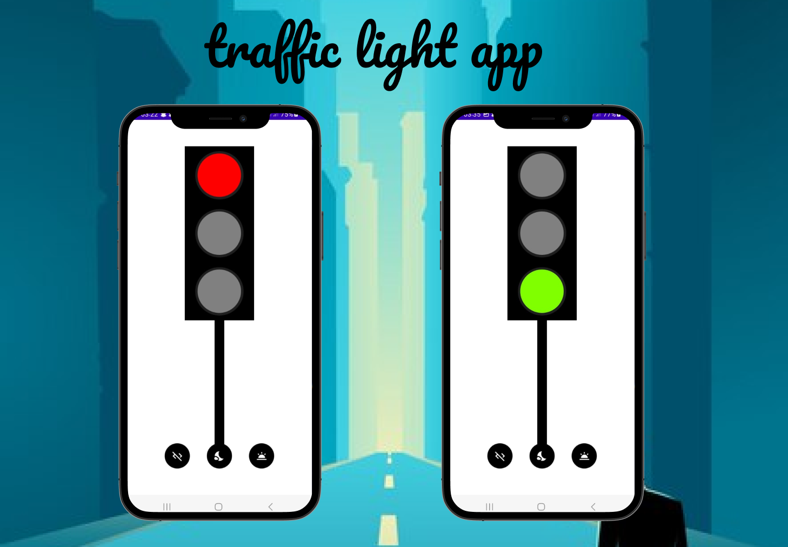

# 🚦 **Trafic Light Application**

## 📖 **Introduction**
The **Trafic Light Application** is a mobile project simulating real-world traffic light systems. It provides functionality to switch between day and night modes and includes a power-off button to simulate turning off the traffic light system. This application is a practical demonstration of managing UI states and transitions in Android development.

---

## 🌟 **Features**
- **Day/Night Mode**:  
  - 3 buttons to toggle between day and night modes.
- **System Power Control**:  
  - A dedicated button to turn off the traffic light simulation.  
- **Realistic Simulation**:  
  - Visual representation of traffic lights transitioning through red, yellow, and green.

---

## 📱 **Screenshots**
<div align=center>

</div>

---

## 🔧 **How to Use**
1. Launch the application.
2. Use the **day/night buttons** to toggle the traffic light mode.
3. Press the **off button** to turn off the traffic light system.
4. Observe the realistic transitions of the traffic lights in each mode.

---

## 🛠️ **Technologies Used**
- **Language**: Java/Kotlin (choose your primary language).  
- **Framework**: Android Studio.  
- **UI Components**: Custom buttons, animations for light transitions.

---

## 🚀 **Setup & Installation**
1. Clone the repository:
   ```bash
   git clone https://github.com/<your-username>/TraficLightApp.git
   cd TraficLightApp
   ```
2. Open the project in **Android Studio**.
3. Build and run the application on an emulator or a physical device.

---

## 🌍 **Future Improvements**
- Add custom timing configurations for traffic light transitions.
- Introduce voice control for switching modes.
- Support for multiple traffic light systems in intersections.

---

## 📄 **License**
This project is licensed under the MIT License. Feel free to use and modify it as needed.

---

## 🤝 **Contributing**
Contributions are welcome!  
- Fork the repository.
- Create a new branch for your feature:
   ```bash
   git checkout -b feature/new-feature
   ```
- Submit a pull request.
  
